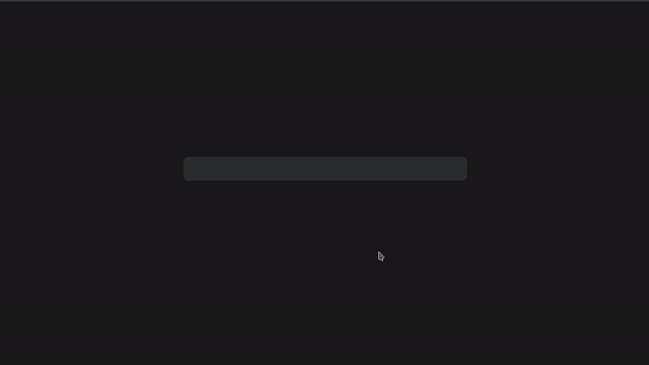

# Short
A link shortener which provides live analytics. 
Backend uses express js and mongodb. Frontend written in Vue.js.
  
Live at: https://ax9d.github.io/short/
<div>Icons made by <a href="https://www.freepik.com/" title="Freepik">Freepik</a> from <a href="https://www.flaticon.com/" title="Flaticon">www.flaticon.com</a></div>

## Setup
Get the code from the repo
```
git clone https://github.com/Ax9D/short.git
```
## Build
After cloning, Install dependencies for both frontend and backend

```
cd frontend && npm install
cd ../backend && npm install
```
## Run
To run the app locally, start the backend server ( inside backend )
```
npm run dev 
```
then run Vue cli's dev server for the frontend ( inside frontend )
```
npm run serve
```


